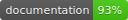

# Track




This packages implements abstraction to track user behaviour in your application. The concrete tracking implementation is provided by you or the provider you are using. You can track with multiple providers in parallel. 

## Installation

Currently only Swift Package Manager is supported. 
Swift Package Manager is a dependency manager built into Xcode.

If you are using Xcode 11 or higher, go to File / Swift Packages / Add Package Dependency... and enter package repository URL https://github.com/dehlen/Track.git, then follow the instructions.

To remove the dependency, select the project and open Swift Packages (which is next to Build Settings). You can add and remove packages from this tab.

## Usage

### Model
First you need to create your models. Track coforms to generic types to allow you to track certain state, action or additional context:

```swift
enum AppState {
  case screen(name: String)
  case userLoggedIn(email: String)
  case userLoggedOut
}

enum AppAction {
  case logoutButtonPressed
  case search(searchTerm: String)
}

enum AppParameterKey: String, AnalyticsParameterKey {
  case language
  case date
}
``` 

### Tracker
With the models in place you can create a tracker to track your incoming events:

```swift
final class AppAnalyticsTracker<S, A, PK: AnalyticsParameterKey>: AnalyticsTracker {

	typealias State = S
	typealias Action = A
	typealias ParameterKey = PK
	
	// MARK: - Lifecycle
	
	public init(id: ID = "AppAnalyticsTracker") {
	    self.id = id
	}
	
	func track(_ event: Event) {
	    // do what ever you want here
	}
}
```

By conforming to `AnalyticsTracker` you can handle the concrete implementation of a event.

### Real World Scenario
Of course in the real world you often have to deal with multiple tracking solutions you need to implement in your app. To cover you in this case Track implements a `MultiTracker`. Several `AnalyticsTracker` can be registered with this approach and all events will be passed to the concrete tracker implementations:

```swift
let subTracker1 = AppAnalyticsTracker(id: "1")
let subTracker2 = AppAnalyticsTracker(id: "2")
let tracker = Analytics.MultiTracker<AppState, AppAction, AppParameterKey>

// register
tracker.register(subTracker1)
tracker.register(subTracker2)

// unregister
tracker.unregister(subTracker1)
tracker.unregister(subTracker2)
```

Now you are able to track arbitrary state/actions and to send these events to all your implemented Analytics platforms:

```swift
let stateEvent = MultiTracker.Event.state(.screen(name: "Login"), [.language : "DE", .date : Date()])
let actionEvent = MultiTracker.Event.action(.search(searchTerm: "Track"), [.language : "DE", .date : Date()])

tracker.track(stateEvent)
tracker.track(actionEvent)
```

## Documentation
The documentation is generated thanks to [jazzy](https://github.com/realm/jazzy).

You can find the latest version here: [Documentation](./docs).

## License
The MIT License

Copyright (c) 2020 David Ehlen

See LICENSE file

